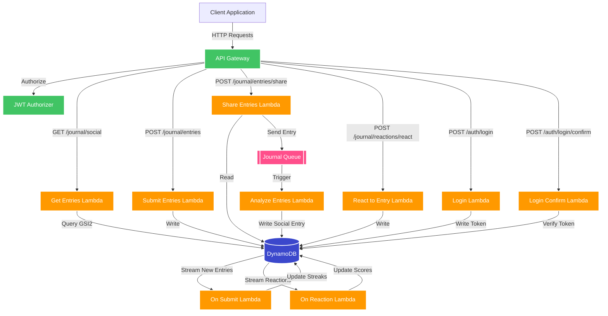

# Social Gratitude

## Architecture

## Prerequisites

Before deploying anything you need to have set up an AWS account and inside that set up the OIDC role `GithubActionsAssumeRole` that grants:

- full access to cloudformation
- read only access to ssm
- read only access to s3
- ability to assume and pass the cdk roles created by bootstrap step (deploy, lookup, and file-publishing)

You will also need to run the `cdk bootstrap` command in the desired acount to allow aws cdk to make changes

You will need to create some parameters in param store. This is used for signing the JWT. If param store is not secure enough you can change the code in the auth stack to control where this value is pulled form.

- `/auth/jwt-secret`: will be used as the secret for signing jwt tokens
- `/auth/jwt-iss`: will be used as the issuer for signing jwt tokens
- `/auth/jwt-aud`: will be used as the audience for signing jwt tokens

> Reasoning: if it's being stored as an env var on the lambda then having it in secrets manager adds no extra security. TODO: can i do this better? i don't want to call secrets manager on every lambda cold start

## Security considerations
- we have the email in the JWT - maybe we use id here and email is only ever used for auth. having the gsi1 as the id allows us to get this info if we so need. I.E account management (FIXED: using id in JWT instead)
- the JWT uses a long secret BUT that could in theory, given enough time, be brute forced. We should rotate this
- OTP on it's own means if an attacker can see emails then they can get in. This could be as simple as seeing the notification on a phone and so the email should be formatted to not show code in subject or preview 